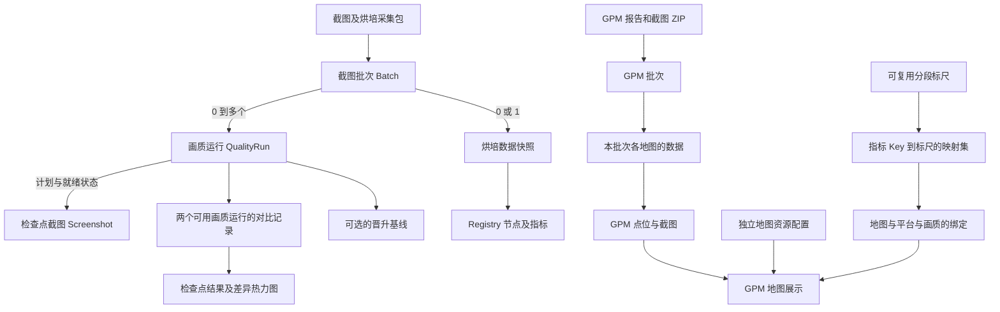

# 业务领域与修改指南

核验日期：2026-08-31。依据是当前工作树的业务文档、前后端实现和隔离环境中的测试，包含当时已有的 GPM 未提交改动。本文件记录业务理解和修改影响，不代表全部设计设想都已实现，也不代替每次修改前的源码核验。

术语定义见 [CONTEXT.md](../CONTEXT.md)。历史设计、接入说明与代码有分歧时，先区分“已确认的产品约定”和“当前实际行为”；不要把历史描述直接当成现状，也不要默认现有行为就是期望行为。已发现的分歧集中记录在第 9 节。

## 1. 项目解决什么问题

PixelComparison 服务于游戏场景的视觉回归、烘培资源规模分析和 GPM 性能采样分析。它接收外部采集结果，不在服务端启动 UE、采集截图、执行场景烘培或计算真实运行时性能。

按功能划分，使用者包括上报数据的采集端/CI、检查截图变化的开发与美术、分析资源和性能变化的开发者，以及维护配置与数据的人员。这只是业务角色划分：当前没有登录、权限或租户模型。

必须区分三条数据链路：

| 业务领域 | 输入 | 核心问题 | 展示与结果 |
|---|---|---|---|
| 截图批次与视觉对比 | 批次元数据、画质运行计划、检查点截图 | 同一检查点在两个版本中发生了什么视觉变化？ | 截图网格、差异热力图；后端另存检查点指标和判定 |
| 场景烘培数据 | 批次随附的 `map-build-data/v2` | 场景或分块的烘培资源规模如何变化？ | Registry 网格、自身/含子级统计、跨批次趋势 |
| GPMHeatmap | 完整性能报告、点位截图 ZIP | 哪个采样点指标较高，同一逻辑点随版本如何变化？ | 地图点位、方向、截图带、详情树、整体/单点趋势 |

截图差异热力图、GPM 点位着色、烘培分块色阶有不同的数据来源和含义，不能复用同一套业务阈值或把其中一种当作另一种的结果。

## 2. 领域关系与存储边界

| 范围 | 当前实现 | 主要数据 | 生命周期 |
|---|---|---|---|
| 截图/烘培主库 | SQLAlchemy 2 + SQLite；默认 `backend/data/shotdiff.db` | `batches`、`quality_runs`、`screenshots`、`map_build_snapshots`、`map_build_registries`、`comparisons`、`comparison_items`、`baselines`、`settings` | 批次显式删除/覆盖；对比产物另有 14 天淘汰 |
| GPM 库 | Python `sqlite3`；默认 `backend/data/gpm_heatmap/gpm_heatmap.db` | `gpm_uploads`、`gpm_upload_maps`、`gpm_points`、地图、标尺、标尺集、条目、绑定 | 上报数据按采集时间保留 30 天；配置独立保留 |
| 图片文件 | 文件系统；SQLite 保存路径与元数据 | 截图原图、WebP 缩略图、差异图、GPM 原图/缩略图、地图底图 | 各自跟随所属对象，缩略图可重建 |
| 运行状态 | 后端单进程内存、前端 Pinia/组件 | 对比队列与进度、请求序号、选中态、页面缓存 | 不等同于持久化业务数据 |

两个业务域可以存在相同 `batch_id`；它们不是同一条记录。不要跨库关联同号批次，也不要让一个域的删除、覆盖或保留策略影响另一个域。

主库使用 WAL、5 秒写锁等待和 `synchronous=NORMAL`。GPM 库也使用 WAL，并为连接启用 `foreign_keys=ON`。主库连接当前没有同样启用外键执行，主库删除必须经过现有 ORM 关系及显式清理逻辑，不能假定任意原生 SQL 删除会自动级联。

证据入口：[models.py](../backend/app/models.py)、[db.py](../backend/app/db.py)、[gpm_storage.py](../backend/app/gpm_storage.py)。

### 2.1 身份不能互换

| 名称 | 真正身份/作用域 | 不可替代它的字段 |
|---|---|---|
| 截图批次 | `batch_id` 在截图域内跨分支唯一 | P4、采集时间、流水线 URL |
| 画质运行 | `(batch_id, shading_quality)` | `tex_quality`、`quality_run_index` |
| 检查点截图 | `(quality_run_id, scene_name)` | 场景 `scene_id`、帧序、文件路径、相机坐标 |
| 截图网格列 | `batch_id:shading_quality` | 单独的批次号 |
| 对比记录 | 同范围、同画质的两个运行；服务按无方向运行对去重 | 单独的两个批次号 |
| 烘培快照 | 一个截图批次至多一份 | 画质运行 |
| 烘培节点 | Registry 路径，以及存在时的分块/子分块索引 | UI 排列顺序；给无索引节点编造的编号 |
| GPM 批次 | GPM 域内唯一的 `batch_id` | 截图域中的同号批次 |
| GPM 本次点位 | 当前上传地图中的序号与内部点位 ID | 跨批次逻辑身份 |
| GPM 单点历史 | 稳定点位序号 `index`，限定分支、地图、平台、画质 | 截图名、数据库点位编号、相近坐标 |
| 地图标尺绑定 | `(map_name, platform, shading_quality)` | 分支；绑定当前不按分支隔离 |

### 2.2 两套上报约束并不相同

| 字段 | 截图/烘培 | GPM |
|---|---|---|
| 场景/地图 | 批次 `scene_id` 对应 UE World；截图 `scene_name` 是检查点 | `map_name`；`pic_name` 仅作受约束的别名，不接受 `scene_id` 替代 |
| 平台 | 归一化 Editor 名称，例如 `WindowsEditor → Windows`、`IOSEditor → iOS` | 严格使用 `IOS`、`Android`、`Windows` |
| 分支 | 小写；允许 `/`，最长 128 | 小写；标识符校验不允许 `/`，最长 120 |
| P4 | 可空 | 必须是非负整数 |
| 画质 | 业务值 0～5；旧数据兼容默认 4；多画质以运行表为准 | 必填 0～5；同次上报各地图必须一致 |
| 采集时间 | 可省略；解析失败当前回退服务器时间；没有统一的显式 UTC 标准化 | 必须带时区；另存 UTC epoch，用于排序与保留 |

不能为了“统一工具函数”直接合并两域的校验。尤其注意 `iOS` 与 `IOS`、分支斜杠、时间解析和旧画质兼容。

## 3. 截图批次：从采集计划到可用数据

### 3.1 采集完成不等于上传完成

多画质设计要求采集端先完成所有计划画质，才产生可上报 manifest；上传阶段则允许部分文件失败。服务端验证提交的结构和声明，不能证明上游实际运行了全部采集步骤。

1. 浏览器将 v1/v2 输入规范化，验证画质唯一、运行序号唯一、检查点唯一、路径及数量。v2 运行必须声明 `complete`，截图清单非空且计数一致。
2. `POST /api/batches` 在一次事务中建立批次、所有画质运行及 `pending` 截图计划。结构错误不能留下半份计划。
3. 按 `batch_id + shading_quality + scene_name` 上传到已声明的截图位置；成功后转为 `ready`。
4. 烘培数据通过独立请求上传到批次。它不需要任何完整截图画质作为前提。
5. 前端只把完整可用的画质运行用于预览、网格、基线选择和对比。

当前完整性判定：

- 新运行：`capture_status == complete`，计划数大于 0，且就绪数等于计划数。
- 直接旧接口或旧库迁移的 `legacy` 运行：至少一张就绪截图即视为可用，因为没有完整的历史计划可核验。
- `quality_runs=[]` 合法，尤其适用于仅烘培；v2 省略运行不能意外生成一个旧式运行。

| 批次实际数据 | 数据能力与用途 |
|---|---|
| 至少一个完整运行，无烘培快照 | 有截图能力，可使用已完整的画质 |
| 至少一个完整运行，有烘培快照 | 截图与烘培能力同时存在 |
| 没有完整运行，有烘培快照 | 仅烘培；可能仍有未完整上传的截图，不能因此显示截图能力 |
| 没有完整运行，也没有烘培快照 | 待补传诊断记录；不能拿它生成图片列或烘培展示 |

`shading_qualities` 表达已声明档位，`available_shading_qualities` 表达可用档位；不要混用。`scene_count` 按就绪截图的唯一检查点名统计，不按多画质重复累加，也不代表完整运行数量。

画质数值为 0 节能、1 流畅、2 均衡、3 精美、4 极致、5 电影。默认预览优先电影，否则取最高的完整画质。`tex_quality` 只记录采集参数，不能参与对比身份或筛选。

### 3.2 重试、覆盖和删除

- 同号批次重新创建默认返回 `409 BATCH_ALREADY_EXISTS`，不是“恢复上传会话”。调整计划或重新上报要求显式整批 `overwrite`。
- 截图批次覆盖不能改变原分支、场景、平台。覆盖删除旧截图、运行、烘培快照、基线关联、相关对比及其派生文件，再重建批次。
- 正在参与对比的批次不能删除或覆盖；后端以冲突阻止破坏正在运行的任务。
- 新画质上传接口区分同 SHA-256 内容的幂等重试和同名不同内容的冲突；相机/帧序还要与计划核对。旧截图上传接口不提供相同的内容幂等行为。
- 当前截图接收使用分块写临时文件、字节上限、PNG 签名检查和原子替换；它不是完整图片解码/总像素校验。不要把“上传成功”当作 Pillow 一定能解码。
- 浏览器会继续尝试剩余截图；烘培失败与截图失败分别显示。任一截图上传失败时，浏览器不会继续自动对比；后端自动对比自身仍按完整画质筛选。
- 缩略图是派生缓存。覆盖/删除时必须先使旧后台缩略图任务失效，防止旧任务在清理后重新发布旧图。

文件替换、数据库事务和后台任务由服务共同协调，不是一个跨文件系统和数据库的事务。现有锁主要是单进程锁，不能据此承诺多实例或断电情况下的全局原子性。

证据入口：[main.py](../backend/app/main.py) 的批次/截图路由、[quality_runs.py](../backend/app/quality_runs.py)、[ManualUpload.vue](../frontend/src/components/ManualUpload.vue)、[thumbnails.py](../backend/app/thumbnails.py)。

## 4. 截图比较：配对、判定与任务

### 4.1 可比较范围

手动和自动比较都要求双方处于同一分支、同一场景、同一平台、同一 `shading_quality`，属于不同批次，并且两个运行都完整可用。不能只验证“两个批次都有截图”。

用户在网格里选择的“基线”只是本次比较的参照侧，不要求存在 `Baseline` 记录。晋升基线有独立的模型和服务逻辑，但当前没有完整的受审计 API、权限与前端晋升流程。

同名检查点配对，取两侧检查点名称的并集：

| 情况 | 对比项状态 | 对整体的影响 |
|---|---|---|
| 两侧都有 | 按差异率判定 `pass / warn / fail` | 有 fail 则整体 fail，否则可能 warn |
| 仅当前侧有 | `added` | 没有 fail/missing 时使整体 warn |
| 仅参照侧有 | `missing` | 整体 fail |

平均差异率只统计真正成对的图片，不能把新增/缺失作为差异率 0 的通过项。名字变化会表现为新增和缺失；帧序或坐标相同不能替代稳定名称。

### 4.2 算法含义

- 图片转换为 RGB；透明通道不参与比较。尺寸不一致时，把参照图缩放到当前图尺寸。
- 一个像素的 RGB 最大通道绝对差严格大于 `pixel_diff_threshold` 才算差异像素；默认阈值 8。
- `diff_pct` 是百分比，默认 `>= 2.0` 为 fail、`>= 0.3` 为 warn，其余 pass。
- SSIM 是全局简化实现，不是滑窗 SSIM；还计算 PSNR、通道差异和 RGB 直方图。
- 差异热力图的 enhanced/legacy 方法及密度、gamma 等设置影响可视化，不等于直接改变 pass/warn/fail 的业务阈值。
- 计算时使用本次捕获的设置。修改全局设置不会自动让已有缓存失效；需要显式重算。

### 4.3 无方向缓存与异步状态

两个运行的正反向请求复用同一比较记录，返回 `flip` 表达请求方向与持久化方向的关系。换向不等于重新运行算法，尤其尺寸不同时不能假定重新计算也会完全对称。

必须分开三种状态：

1. 只读 lookup 的 `missing / running / done`：是否有可复用结果或当前任务。
2. 任务的运行/完成/错误及进度：是否算完，不代表视觉结果通过。
3. 比较项与整体的 `pass / warn / fail / added / missing`：业务判定。

创建接口先提交比较记录，再交给有界后台线程池；因此存在数据库行不等于已经完成。当前实现先检查运行任务，并拒绝把无明细的空行当成可复用完成结果。只读 lookup 绝不触发计算。

默认全局两个比较工作线程，队列有上限。满队列返回 503；多画质自动对比按档返回 `queue_full`，已经接受的其他档仍可执行。后台最多尝试三次。任务状态只存进程内存；服务重启后不能继续依赖旧 `task_id`。

强制重算复用记录 ID，但当前会先删除旧热力图、替换明细，最终失败还会删除比较记录，旧有效结果可能丢失。它不是“新结果成功后再切换”的安全发布流程。

### 4.4 自动参照的当前排序

每个完整画质单独选候选，并排除不同分支、场景、平台、画质以及不完整运行。

- 有 P4：候选为更小 P4，或相同 P4 且采集时间更早；统一按 P4 降序、时间降序，选首个可用候选。因此相同 P4 的更早批次会排在更小 P4 之前。更小 P4 的候选没有额外的“采集时间更早”条件。
- 无 P4：选采集时间更早且最近的可用批次。
- 无候选返回 `matched=false`；不是上传失败，也不是比较错误。

例如目标 P4=100，候选 A 为 P4=99，候选 B 为更早采集的 P4=100，当前实现选 B。接入文档写的“小 P4 优先，同 P4 回退”会选 A；修改这部分前需明确期望，不能不加说明地改排序。

证据入口：[service.py](../backend/app/service.py)、[compare.py](../backend/app/compare.py)、[main.py](../backend/app/main.py) 的 `_create_comparison`、`lookup_comparison`、`auto_compare_batch`、[task_executor.py](../backend/app/task_executor.py)。

## 5. 烘培数据：节点口径与趋势

### 5.1 快照与拓扑

一个批次至多一份 `map-build-data/v2` 快照，独立于截图画质。当前服务端没有“必须存在电影画质”的限制。相同格式与规范化内容重试幂等，不同内容返回冲突，需整批覆盖。

服务同时保存完整规范化 JSON 与常用指标索引；趋势查询不应为每个点加载完整原始 JSON。路径在同批次内唯一，数字分块/子分块组合不能冲突，子分块必须有父分块索引。

- 主分块：根 Registry 的自身资源，不是整个场景含子级总量的同义词。
- 数字分块及子分块：按上报索引定位。
- 反射分块等无数字索引的根直属节点：按完整 Registry 路径选择、展示详情和查询趋势，不能编造成“第 4 分块”。
- 老数据缺少某些拓扑或可选指标时有兼容回退；不要把回退结果误认为上游提供了完整树结构。

### 5.2 统计口径

`self_metrics` 表示自身，`subtree_metrics` 表示自身加全部后代，兼容字段 `metrics` 指向含子级汇总。不能把父节点 subtree 与子节点再相加。

核心指标包括 resident bytes、all mips bytes、cook estimate bytes、texture count；资源细则再拆为光照贴图、阴影贴图、反射、体积光照等上报项。这里是烘培数据规模/估算，不是 GPM 的运行时采样，也不能直接宣称是设备峰值显存。

前端默认“仅自身”；口径控制节点头部、选中详情和趋势。子分块网格的色阶使用自身 all-mips 大小。没有子级或缺少对应口径时页面会降级到可用口径，并同步趋势。体积单位 MiB 为 `1024²` 字节，纹理数量单独展示。

### 5.3 批次选择与历史窗口

- 概览展示一个批次，省略批次参数时选择当前分支/场景的最新采集批次，不计算上一批次增量。
- 前端新进入页面及刷新跳到最新批次；页面内主动选历史批次或点击趋势点有效。URL 可恢复节点、统计口径和趋势范围，但重新挂载不保证固定在 URL 的历史批次。
- 切换批次不一定重取趋势；节点丢失则回到主分块，口径变化则同步更新趋势。刷新失败保留上一份成功数据并显示错误。
- 前端不按平台、画质筛烘培数据。后端尚有兼容参数，其中旧批次画质字段不能当作多画质事实来源。
- 最近 N 天以该场景最新快照的日期为结束日，不以今天或选中的历史批次为结束日。前端提供 7/14/30/60/90 天，接口允许 1～365 天。
- 自定义日期包含首尾，最多 90 天。同一天多个批次全部保留；最多返回最新 2000 个点，并提供 `truncated`。
- 某批次没有所选节点时，趋势点为 `null`，折线应断开；这与旧 payload 缺少某个可选资源项按 0 兼容不同。

证据入口：[map_build.py](../backend/app/map_build.py)、[MapBuildView.vue](../frontend/src/views/MapBuildView.vue)、[mapBuildPresentation.js](../frontend/src/mapBuildPresentation.js)、[MapBuildTrendChart.vue](../frontend/src/components/MapBuildTrendChart.vue)。

## 6. GPMHeatmap：上报、点位与配置

### 6.1 完整上报与资源一致性

GPM 接收一次完整的报告 JSON 和截图 ZIP；一个批次可以包含多个地图，但每个地图的 P4、平台和画质必须一致。地图名不能重复。点位包括序号、截图标识、位置、方向、热力指标、趋势指标和详情树；当前用点位序号 `index` 关联同一地图各批次中的逻辑采样点。

点位截图以报告中的 `screenshot_id` 精确匹配 ZIP 图片文件名的主体；整个上传内不能重复，大小写冲突也会拒绝。不能以遍历顺序、邻近名字或其他点截图兜底配对。

当前校验包括报告/压缩包大小、解压总量、文件数、点位数、JSON 深度、路径安全和图片解码像素限制。主要上限为：报告 64 MiB、ZIP 1 GiB、解压 4 GiB、5000 文件/点位、深度 32、单图 4000 万像素。调整限制时必须同时考虑暂存磁盘、解码内存及最坏并发。

所有输入和缩略图先在独立暂存区准备；提交时写入新的资源版本目录与完整数据库对象，再清理旧资源。正常失败不会把一半报告发布为可查批次。同号重复上报默认冲突，即使内容相同；显式覆盖要求分支不可变，但没有截图批次同样的“平台/场景不变”限制。

上报图、点位图及缩略图位于本次上传的独立 UUID 目录。清理必须针对具体版本目录，不能把复用批次号的整个父目录当作已过期资源删除。

### 6.2 展示依赖独立配置

地图配置是跨批次、跨分支共享的资源。报告出现未知地图时，会在同一上报事务中自动登记一个只有名称和排序 ID 的待配置项；上报失败则一并回滚。系统不会猜测底图、坐标范围或标尺，设置页和批次页面应继续明确显示缺失状态。

配置关系只有三层：

1. **地图资源**：名称、排序、描述、坐标起点与范围、轴向、可选底图。
2. **指标标尺与标尺集**：可复用颜色区间；标尺集手工维护精确 Key 到标尺 ID 的引用。
3. **地图绑定**：地图在指定平台/画质下使用哪个标尺集，不包含分支，也不存在地图对单指标的局部覆盖。

没有可用地图配置/底图时展示缺配置状态，不能根据当前点位范围自动拟合一张假地图。编辑共享标尺会影响所有引用者，包括后续查看历史批次时的颜色，因为配置不是每个批次的历史快照。

固定标尺支持 2～10 个颜色区间、有限数字、`< <= > >=` 与 `&`；所有区间必须无缝覆盖整个数轴且不重叠，边界不能同时归属或两边都不归属。区间列表顺序用于展示，数值归属由表达式决定。前后端编译器应保持一致，不使用任意代码求值。

没有绑定或没有精确匹配 Key 时，使用当前数据集最小到最大值的动态线性颜色。它表达相对高低，不表示是否达标；跨批次的同一种颜色不能直接当作相同绝对数值。非有效数值为灰色。

配置 ID 可以为 0；不能用真假判断 ID 是否存在。标尺/标尺集改名保持引用；被引用的配置不能直接删除。保存和导入需要尊重 revision 冲突，不可用旧表单覆盖他人修改。地图表单把多选平台/画质展开为作用域组合，提交前拒绝重复绑定；地图信息、绑定及可选图片按一次操作保存。

### 6.3 地图、截图和详情的同一个选择

地图方块、截图带、详情、单点趋势共享当前 `selectedPointId`。不能让旧详情响应覆盖新选中点。

同一地图内切换平台、画质或批次时，按点位序号 `index` 恢复相同逻辑点；新作用域没有该序号时回到首点。切换地图不继承点位选择。采集端必须保证同一地图各批次中相同 `index` 表示同一逻辑采样点；`screenshot_id` 是该序号的数字文本（允许前导零），只负责匹配截图资源。

地图点位悬停面板的指标变化率比较同分支、地图、平台和画质下数据库 ID 紧邻的上一条上报，并按相同 `index` 匹配点位。该比较口径是上报入库顺序，不是 `captured_at` 时间顺序；上一批、同序号点位、对应指标缺失或上一批指标值为 0 时不产生百分比。地图和单点趋势仍按采集时间排列，两种口径不能混用。

坐标投影要先计算底图在容器内的等比包含矩形，再按起点/范围映射，应用 X/Y 轴向；屏幕 Y 轴与世界轴方向不同。位置和方向的转换规则各有现有测试，修改时至少验证非正方形底图、留白、四种轴向组合、零方向及越界点。越界点不画到地图上，但仍属于上报数据。

鼠标命中使用空间网格索引，只命中当前绘制的点；配置色段隐藏后，相应地图点也不能继续被命中。悬停和选中点的方向箭头需要保持正确绘制层级。

详情为递归的分组/表格结构，同时兼容 `children` 和 `treeData`。展开与排序状态按结构路径保留在本次页面会话，切换点位可恢复；每张表分页显示，空值排序不能因升降序跑到前面。浏览器刷新不是永久保存该展开状态。

### 6.4 两种趋势不是同一个统计

整体平均趋势读取报告 `trend[].summary_data`，不重新平均 `heat_map_data`。当前后端约定和前端趋势卡片仅覆盖下表四项：

| 趋势 Key | 上报平均字段 |
|---|---|
| `Scene_DC` | `AvgSceneDrawCall` |
| `Scene_Tris` | `AvgSceneTriangle` |
| `Drawcall` | `AvgDrawCall` |
| `Triangle` | `AvgTriangle` |

支持任意热力指标 Key 配色，不等于任意 Key 已支持趋势展示。

单点趋势读取同分支、地图、平台、画质和同 `point_index` 的 `trend_data`。趋势缺失值应断线，不能变成 0。

GPM 趋势天数为 7/14/30，默认 14，以当前作用域最新采集时刻为锚点，开始为最新 epoch 减 `(days - 1) × 86400`。它不是烘培趋势的自然日窗口，也不是 GPM 数据保留的“当前 UTC 时间减 30 天”。

页面初始选择优先有数据的 IOS，否则选有数据的平台，再选地图/画质；合法但无数据的筛选值应保留并展示空态。变更平台、地图或画质时，以当前 P4 为锚选择最接近的候选；距离相同优先更高 P4。新进入页面和手动刷新优先最新批次。GPM 顶栏当前只手动刷新。

证据入口：[gpm_upload.py](../backend/app/gpm_upload.py)、[gpm_workspace.py](../backend/app/gpm_workspace.py)、[gpm_map_config.py](../backend/app/gpm_map_config.py)、[gpm_scale_config.py](../backend/app/gpm_scale_config.py)、[gpmHeatmapStore.js](../frontend/src/stores/gpmHeatmapStore.js)、[GpmHeatmapView.vue](../frontend/src/views/GpmHeatmapView.vue)、[mapProjection.js](../frontend/src/gpmHeatmap/mapProjection.js)。

### 6.5 配置包不是业务数据库备份

格式是 `pixelcomparison-gpm-config` v1，可选 `all / maps / scales`，包含可读 JSON 和必要的底图，不含批次、点位、截图和趋势数据。

- `maps` 只迁移地图资源；`scales` 迁移标尺、标尺集和地图绑定，不改地图坐标与底图。
- inspect 验证格式、路径、引用、图片和差异，产生暂存候选与 `import_id`，不写线上配置。
- apply 重新验证候选内容及全局配置版本指纹；检查后若配置改变，即使不在某个用户当前编辑对象上，也可能要求重新检查。
- 合并保留包外地图、标尺与标尺集，但包内某个标尺集的 `items`、某个地图的绑定清单是完整替换。`image.file=null` 明确表示该地图没有图片，可能移除已有底图。
- ID 不自动按名称重映射；ID、名称、revision 与引用均需检查，不能将跨环境导入当作简单名称合并。
- 数据库写入和新文件发布有失败补偿，旧文件在成功提交后清理；这不等于进程崩溃或磁盘故障下已有完整恢复协议。
- 保存/应用成功后的刷新失败是读取问题，不能在 UI 中误报成“保存失败”并诱发重复提交。

标尺集指标按提交顺序显示；普通编辑、配置包导出、导入检查和应用均保持同一顺序。

证据入口：[gpm_configuration_package.py](../backend/app/gpm_configuration_package.py)、[GpmConfigurationTransfer.vue](../frontend/src/components/GpmConfigurationTransfer.vue)、[gpmScaleConfigStore.js](../frontend/src/stores/gpmScaleConfigStore.js)。

## 7. 页面、URL 与请求生命周期

| 当前入口 | 职责 | 状态归属 |
|---|---|---|
| `/screenshot/:sceneId?` | 多版本截图网格、角色选择与差异图 | `screenshotComparisonStore` |
| `/map-build/:sceneId?` | 烘培网格与趋势 | `MapBuildView` 内独立状态 |
| `/gpm-heatmap/:mapName?` | GPM 点位、详情与趋势 | `gpmHeatmapStore` |
| `/batch-management/capture` | 全部截图批次目录与维护 | `batchCatalogStore` |
| `/batch-management/gpm` | GPM 批次目录与维护 | `gpmBatchStore` |
| `/settings/screenshot-comparison` | 全局截图参数与筛选默认值 | `projectStore` |
| `/settings/gpm-heatmap` | 地图、标尺和标尺集配置 | `gpmScaleConfigStore` |

根路径及未知页面回到 `/screenshot`；`/batches` 和 `/settings` 保留重定向，旧 `/batches/:sceneId` 转截图页面。没有独立的对比历史或结果详情前端页面；后端历史/详情 API 仍保留。

以下是修改页面时要保持的交互约束：

- 项目初始化只共享元数据、设置和上报弹窗。批次目录、截图网格和 GPM 数据不能共用同一份筛选/加载/错误状态。
- 截图网格按批次从旧到新、同批次内画质从高到低展开。其批次排序主要使用批次号的数字排序，不是统一按 P4。目录则反向显示。
- 截图角色在 URL 中携带批次与画质；只能恢复当前筛选可见、完整且范围合法的角色，不能为恢复角色擅自放宽日期/画质筛选。
- 连续日期默认滚动最近 7 天，设置可调整到 1～14 天；手动固定范围与滚动范围区别保存。指定日期全部取消应得到空结果，不能解释成不限日期。
- 截图预览左右跨列、上下跨检查点，跳过无图位置；邻图预加载有并发上限，并在关闭/离开时停止。缩略图和原图不能混用缓存 URL。
- 只缓存 `ScreenshotComparisonView` 的重型网格 DOM。停用页面必须取消/失效旧请求及轮询；保留 DOM 不等于继续拥有路由写入权。
- 各异步通道使用请求序号、取消和身份检查，只有最新请求可更新状态。离开页面停止前端轮询，不会取消已提交的服务器比较任务。
- GPM 离开守卫必须早于异步目标页加载完成使旧页失效，避免迟到初始化把用户导航拉回热力图。
- 顶栏通过 `pageActions` 只刷新当前页面；非 GPM 数据页支持两分钟自动刷新，后台标签页、上报弹窗打开或正在对比时跳过。
- 从管理/设置返回工作区使用受约束的本地 `return_to`，不是任意外部跳转地址。

场景目录是全局配置：`None` 表示尚未配置权威目录，`[]` 表示明确的空目录。目录中的无数据场景仍可展示为空态，未配置场景是否附加显示由设置控制；目录可见性、当前分支的数据能力、当前日期/画质下的数据可用性是不同概念。

证据入口：[router.js](../frontend/src/router.js)、[workspaceNavigation.js](../frontend/src/workspaceNavigation.js)、[screenshotRoute.js](../frontend/src/screenshotRoute.js)、[store.js](../frontend/src/store.js)、[App.vue](../frontend/src/App.vue)、[TopBar.vue](../frontend/src/components/TopBar.vue)、[BatchGrid.vue](../frontend/src/components/BatchGrid.vue)。

## 8. 数据保留、迁移与运行安全

| 对象 | 当前规则 | 不应推导出的结论 |
|---|---|---|
| 截图批次/烘培快照 | 显式删除或覆盖 | 没有统一随比较结果 14 天过期 |
| 比较记录、明细、差异图 | 按比较记录创建时间 14 天；创建/完成比较时触发淘汰，跳过运行项 | 不是精确到期即删除的定时任务 |
| 截图缩略图 | 约 60 天未访问淘汰，可从原图重建；命中刷新 mtime | 不能同样删除原图 |
| GPM 上传、地图数据、点位及上传资源 | 按当前 UTC 与采集 epoch 的 30 天差值；启动、周期任务、成功上报触发 | 不是按入库时间；不包括地图/标尺配置 |
| SQLite 日备份 | SQLite 在线 backup API，校验后发布；默认日期保留参数 30 天 | 不包含截图、地图和其他图片资源；默认同盘不防磁盘损坏 |

主库当前 schema v2。升级旧截图库前先创建独立迁移备份，备份失败拒绝继续；旧运行、截图、基线和比较引用要一起迁移。历史跨画质比较可被标为 `legacy_incompatible`，不得伪装成有效缓存。SQLite 表重建要防止外键残留指向 `_batches_old`；现有迁移和测试专门覆盖这一问题。

GPM 当前采用另一条初始化策略：不仅检查 schema 版本，还核对表/列指纹，不兼容的旧 Demo 库会整体重建并清理相应资源。这不同于主库的保数据迁移，也不同于只删过期上传的常规保留策略。修改 GPM schema 或把现有库接入新代码前，必须先检查这条路径。

`app.main` 导入期间会初始化数据库。只想查看模块或跑试验时，不要在真实数据环境中直接导入后再设置环境变量。测试启动前就要隔离 `PIXELCOMP_DATA_DIR`，并检查独立的 DB、图片、缩略图和 GPM 路径覆盖项。

人工孤儿文件清理不应与上传/比较并行。浏览器 E2E 脚本可能发起真实比较并触发淘汰，不能当成对生产环境无副作用的读取。旧按日期清理脚本查询批次时未传分支，当前实际只查默认 `main`，不能声称它遍历了全部分支。

运行架构是 Vue 3 + Pinia + Vue Router + Arco/Vite 前端，FastAPI/Uvicorn 后端，Pillow/NumPy 图片处理。开发默认 5173 代理到 8020；生产脚本以单进程服务托管 `frontend/dist`。没有 Redis、Celery 或多节点协调，不能只增加 Uvicorn worker 就得到正确的多实例任务语义。

证据入口：[backup.py](../backend/app/backup.py)、[cleanup.py](../backend/app/cleanup.py)、[gpm_retention.py](../backend/app/gpm_retention.py)、[db.py](../backend/app/db.py)、[gpm_storage.py](../backend/app/gpm_storage.py)、[脚本说明](../scripts/README.md)。

## 9. 已验证的偏差与待确认边界

本表不是自动修改授权，也不是完整安全审计。它用于防止后续开发建立在错误前提上。

| 主题 | 文档/表面印象 | 当前证据与修改注意事项 |
|---|---|---|
| 自动比较优先级 | 小 P4 优先，相同 P4 是回退 | 当前合并候选后 P4 降序，相同 P4 更早批次优先；两类候选同时存在时需补针对性验收 |
| 旧演示上传脚本 | 名称和注释可能让人以为是当前生产上报器 | `mock_uploads/upload.py` 仍读旧顶层截图，重复批次 409 后继续补传，还可从 manifest 读取 overwrite；不代表新上报契约 |
| 设计方案的状态段落 | 多画质设计标记完成；前端重构仍标记待实现 | 历史“当前差距”段落与实际现状不同；现已存在运行表、计划上传、拆分 store 和新路由，仍有编排留在 `main.py` |
| TODO 的 P0 列表 | 上传限制、同名并发、请求序号等都未完成 | 字节限制/PNG 签名、临时发布、提交锁和多处请求防过期已经实现；完整图片解码限制、崩溃恢复、多实例语义不能因此视作已完成 |
| 任务持久化 | 旧 TODO 说空比较行可能被当成完成 | 当前 lookup/create 已区分运行与空行；任务进度仍未持久化，重启恢复仍是缺口 |
| 安全合并配置 | 包外全部内容都不会删除 | 包外顶层实体保留；包内条目/绑定列表完整替换，显式空底图会清除图片 |
| 历史批次深链 | URL 带 batch 就一定固定历史批次 | 烘培与 GPM 新进入页面优先最新；截图角色则恢复可见合法运行。三页语义不同 |
| 上游采集过程 | 仓库设计提及 ArashiTestCase/UE 生产脚本 | 本次核验未读取外部采集仓库、执行真实 UE 采集或验证生产部署，不能保证外部实现与这里完全一致 |

修改相关行为时，应在同一变更中更新接入说明/业务文档和对应测试；有产品歧义的先明确目标，再改行为。

## 10. 按修改范围选择回归

测试目录中存在以下直接相关覆盖。表中列的是优先入口，不保证某个文件覆盖了该领域所有边界。

| 修改范围 | 后端测试（`backend/tests/`） | 前端测试（`frontend/src/` 下） | 必须保留的场景 |
|---|---|---|---|
| 批次/画质/上报 | `test_multi_quality.py`、`test_shading_quality.py`、`test_overwrite_batch.py`、`test_concurrency.py` | `components/ManualUpload.test.js`、`components/BatchPreview.test.js`、`mapBuildManifest.test.js` | 0 档不是空值；混合完成度；同内容重试/不同内容冲突；旧格式与仅烘培 |
| 分支/场景/日期/排序 | `test_branch_tag.py`、`test_scene_catalog.py`、`test_date_filter.py`、`test_batch_order.py` | `batchRoute.test.js`、`screenshotRoute.test.js`、各 catalog/project store 测试 | 空目录与未配置；空日期选择；合法无数据选项；深链与最后一次请求 |
| 对比与缓存 | `test_compare_engine.py`、`test_multi_quality.py`、`test_compare_swap.py`、`test_auto_compare.py`、`test_grid_heatmap_lookup.py` | `stores/screenshotComparisonStore.test.js`、`components/BatchGrid.test.js` | 同批次拒绝；跨范围拒绝；同批次不同画质不串缓存；正反向复用；lookup 不写入 |
| 任务/删除/图片缓存 | `test_compare_retry.py`、`test_comparison_retention.py`、`test_task_prune.py`、`test_delete_batch.py`、`test_thumbnail.py`、`test_image_cache.py`、`test_cleanup.py` | 截图 store、网格、预览测试 | 运行时拒绝删除；满队列；迟到任务不重建旧缩略图；缓存版本变化 |
| 烘培拓扑/指标/趋势 | `test_map_build_data.py` | `views/MapBuildView.test.js`、`mapBuildPresentation.test.js`、`components/MapBuildTrendChart.test.js` | 自身/含子级；无索引反射分块；缺节点断线；同日多点；历史切换；90 天边界 |
| GPM 上报/目录/保留 | `test_gpm_heatmap.py`、`test_gpm_storage.py` | `stores/gpmBatchStore.test.js`、`stores/gpmHeatmapStore.test.js`、`gpmBatchRoute.test.js` | 域隔离；截图严格匹配；覆盖失败保旧；UTC 边界；配置不随保留删除 |
| GPM 地图/颜色/详情/趋势 | `test_gpm_heatmap.py`、`test_gpm_scale_expressions.py` | `gpmHeatmap/*.test.js`；`components/` 下的 `GpmMapCanvas.test.js`、`GpmDetailNode.test.js`、`GpmDetailPanel.test.js`、`GpmTrendCard.test.js`、`GpmScreenshotStrip.test.js` | 轴向与留白；边界区间；未知 Key 回退；稳定点位序号；详情状态与迟到响应 |
| GPM 配置与导入 | `test_gpm_configuration_package.py`、`test_gpm_heatmap.py` | `stores/gpmScaleConfigStore.test.js`、`components/GpmConfigurationTransfer.test.js` | ID=0；引用保护；revision 冲突；inspect 无线上写入；清单替换；指标顺序全链路 |
| 路由/全局刷新 | 按受影响 API 选择 | `router.test.js`、`workspaceNavigation.test.js`、`bootstrap.test.js`、`components/TopBar.test.js`、各 view 测试 | KeepAlive 停用；异步目标页；刷新只作用当前页；返回地址合法 |
| 数据库与运维 | `test_backup.py`、`test_multi_quality.py`、`test_gpm_storage.py` | 通常无直接前端单测 | WAL 在线备份；先备份后迁移；旧引用完整；GPM 不兼容初始化；图片资源独立恢复 |

建议每次实际修改按此顺序检查：

1. 读本文件、术语表和相关代码，确认本次改的是哪一个域、哪一种身份/状态/时间口径；先查看已有工作树改动。
2. 从 UI/上报输入追到 API、数据存储与读取投影，检查关联的覆盖、删除、缓存和配置路径。
3. 选择能区分正确/错误行为的具体场景验证；需要修复或新增业务行为时补相应回归，不为纯文字改动编造测试。
4. 前后端契约或持久化含义改变时，运行相关两侧测试；发布前另做构建和隔离浏览器验收。
5. 同步更新受影响的术语和文档，并明确哪些既有偏差已消除、哪些仍保留。

## 11. 本次核验基线与未覆盖范围

本轮在补充领域指南和术语的同时，审查并优化了当前工作树中的 GPM 地图配置、标尺顺序、点位选择和前端交互改动；没有读取或修改真实业务库。

| 验证 | 2026-08-31 结果 |
|---|---|
| 前端 `npm.cmd test -- --reporter=dot` | 45 个文件，267 项通过 |
| 后端 `.venv\Scripts\python.exe -m pytest -q` | 219 项通过；仅有 TestClient 依赖弃用警告 |
| 前端 `npm.cmd run build` | 生产构建通过；保留既有的主包大于 500 kB 提示 |
| `git diff --check` | 通过 |

GPM 保留测试的策略时钟和样本生成时钟均固定到 `2026-08-29T00:00:00Z`，避免 30 天边界随实际运行日期漂移；拒绝过期上报、清理关联数据并保留独立配置的完整用例已通过。

隔离执行时，在启动测试进程前设置临时 `PIXELCOMP_DATA_DIR` 并禁用 `PIXELCOMP_BACKUP_ENABLED`，同时清除/隔离 `PIXELCOMP_DB_PATH`、`PIXELCOMP_IMAGES_DIR`、`PIXELCOMP_THUMB_DIR`、`PIXELCOMP_GPM_DIR`、`PIXELCOMP_GPM_DB_PATH`、`PIXELCOMP_GPM_ASSETS_DIR` 的生产覆盖值。仅设置 DATA_DIR 不能覆盖这些更高优先级路径。

本次覆盖源码、现有设计/接入文档、示例脚本和现有自动化测试；没有读取真实库的业务内容，没有对真实数据运行迁移/清理，没有对生产服务写入，也没有做本轮浏览器 E2E、真实 UE 上报、备份恢复演练或生产规模压测。上述业务模型是后续修改的检查依据，不能替代针对具体变更的回归验证。
